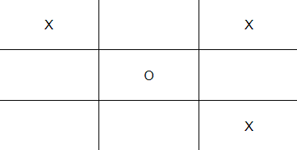

#   TOP TIC TAC TOE

Creating a tic tac toe algorithm.

>Love this progress? Buy me a coffee...
---

This is the creation of a **TIC TAC TOE** program specified for two participants

If you have not yet played or seen such a game it is one that can either be played by at least two players. Depending with players choice it can be played on any surface. In our case we have written it into a program to be executed according to user inputs

Eample



## Development
> Want to contribute? Great!

To fix a bug or enhance an existing module, follow these steps:

1. Fork the repository

    ```
    https://github.com/keithowino/top-tic-tac-toe/fork
    ```
2. Create a new branch

    ```
    git checkout -b improve-feature
    ```
3. Make the appropriate changes in the files
4. Add changes to reflect the changes made
5. Commit your changes

    ```
    git commit -am 'Improve feature'
    ```
6. Push to the branch

    ```
    git push origin improve-feature
    ```
7. Create a Pull Request 


## Setup/ Installation Requirements
- To clone this repository to your machine do this in the root directory of where you would like to save the project. Before using this be sure which url link you should use, is it for HTTP or shh.

    ```
    git clone https://github.com/keithowino/top-tic-tac-toe.git
    ```

- Open the repository.

    ```
    cd top-sub-strings
    ```

- After this in order to execute the program, you need to enter `ruby ./scripts/main.rb` on a Git terminal.

## Installation Medium
1. Steady Network.
2. Weblink
3. Github account.

## Bug / Feature Request

- If you find a bug (the website couldn't handle the query and / or gave undesired results), kindly open an issue here > (https://github.com/keithowino/top-tic-tac-toe/issues/new).